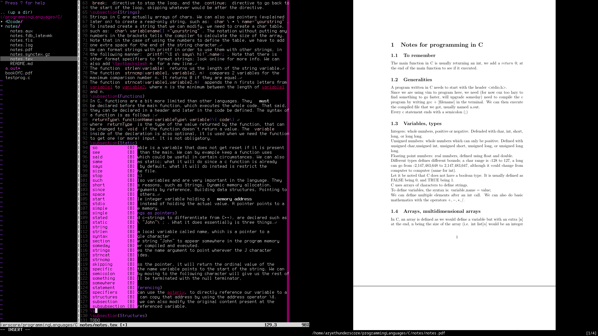

# archDotfiles

Small repo of my dotfiles. I didn't really change a ton on theses, but feel free
to look around or yank some stuff for yourself.

## Example pictures

vim :

As you can see, I use vimTree and Ultisnips for a more practical experience. I
got a weird colorway too that I appreciate quite much. The font is Terminator.
